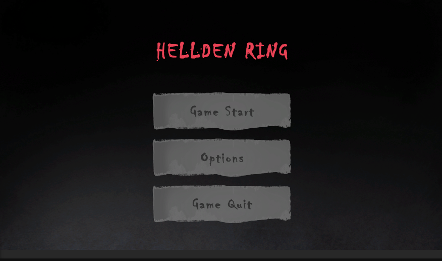
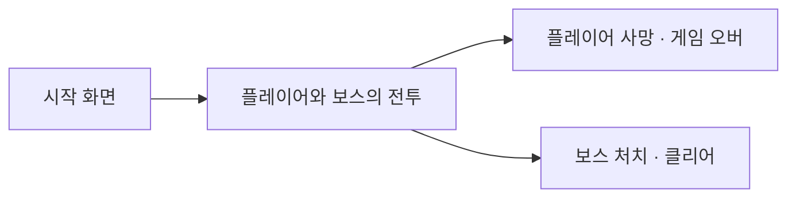
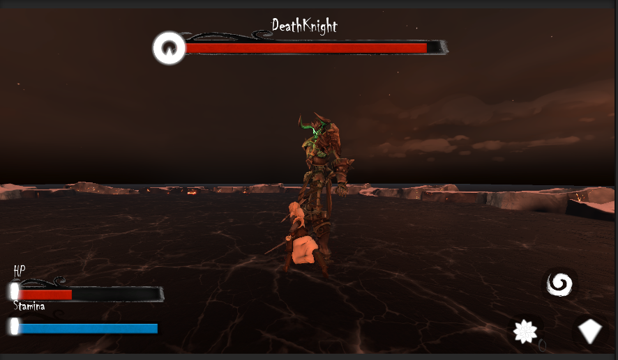
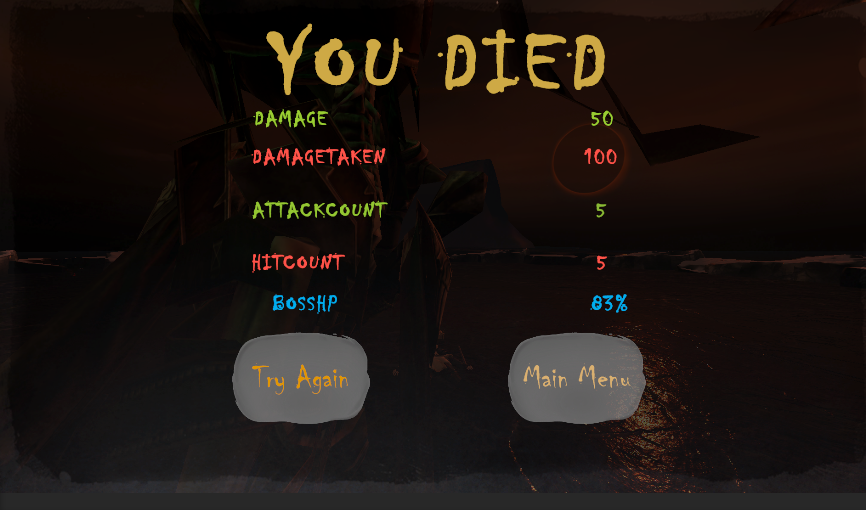
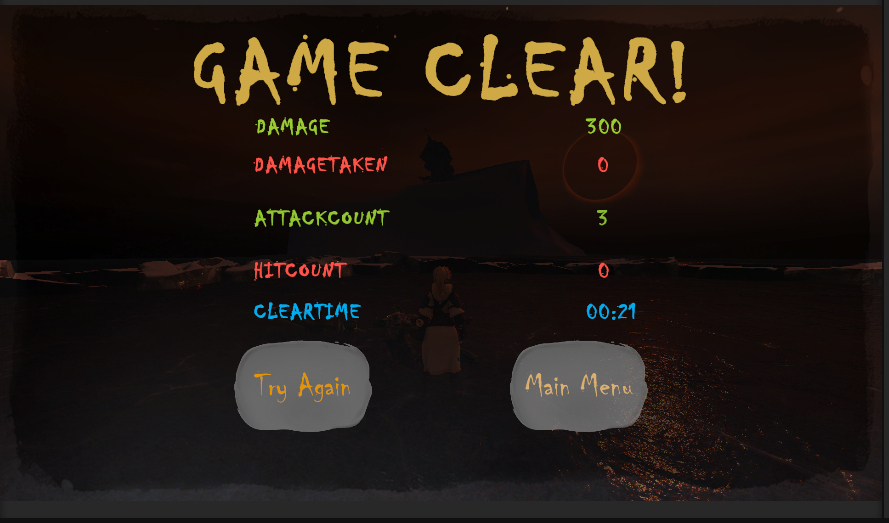
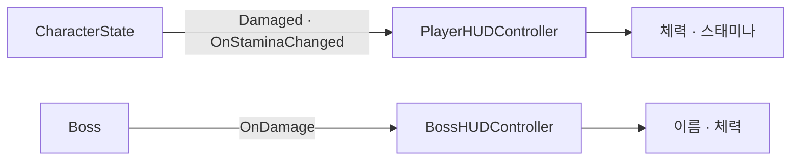
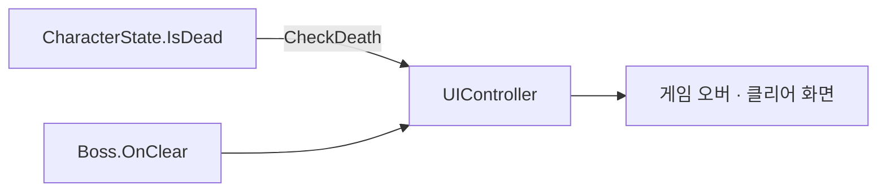
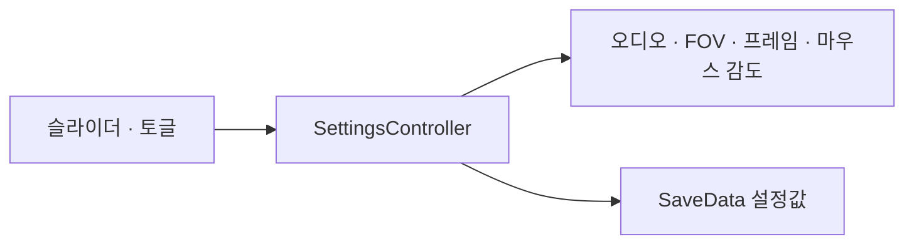
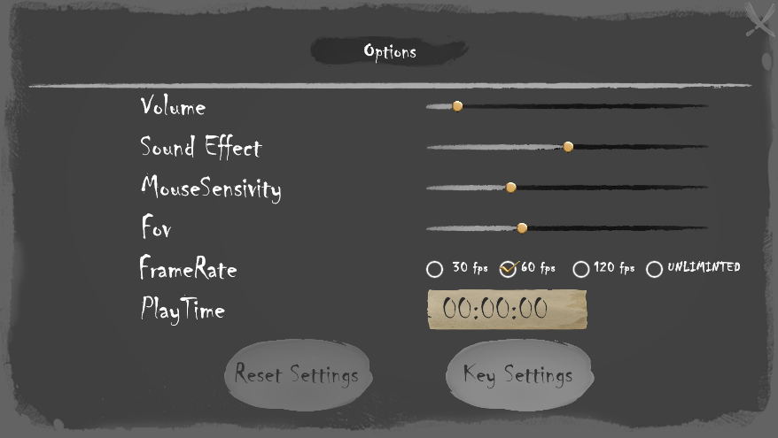

# Hellden RIng — 3인칭 액션 게임 (UI 담당)

<p align="center">
  
</p>

> 플레이어와 보스가 한 번의 전투를 진행하는 3D 액션 게임입니다.  
> 팀 프로젝트에서 **전투 HUD**, **결과 UI**, **설정값 적용**을 담당했습니다.

## 게임 소개

| 항목 | 내용 |
| --- | --- |
| 장르 | 3인칭 액션 게임 |
| 진행 | 시작 화면 → 보스 전투 → 게임 오버 또는 클리어 |
| 목표 | 보스 체력이 0이 되면 클리어 |

## 프로젝트 소개

| 항목 | 내용 |
| --- | --- |
| 제작 형태 | 팀 프로젝트 |
| 개발 기간 | 2026.04.29 – 05.12 (Git 기록) |
| 본인 담당 | 전투 HUD · 결과 UI · 설정값 적용 |
| 엔진 | Unity 6.3 |
| 구현 언어 | C# |
| UI | uGUI · TextMeshPro |
| 저장 형식 | Newtonsoft.Json |
| 저장소 | [toy-project-0-team-6](https://github.com/Devel-Rocket-ClassRoom/toy-project-0-team-6) |

## 게임 흐름



## 플레이 미리보기

| 시작 화면 | 전투 화면 | 게임 오버 | 클리어 |
| --- | --- | --- | --- |
|  |  |  |  |

## 담당 영역 — 전투 HUD

플레이어와 보스의 상태가 바뀔 때 발생하는 이벤트를 각 HUD 컨트롤러가 받아 화면에 반영합니다.



- `PlayerHUDController` = `CharacterState.Damaged`와 `OnStaminaChanged`를 구독해 플레이어 체력과 스태미나를 갱신합니다.
- `BossHUDController` = `Boss.OnDamage`를 구독해 보스 체력을 갱신하고, 보스 데이터의 이름을 출력합니다.

## 담당 영역 — 결과 UI

`UIController`가 플레이어 사망과 보스 클리어를 각각 확인하고, 전투 중 기록한 값을 게임 오버 또는 클리어 화면에 출력합니다.



| 결과 화면 | 출력 내용 |
| --- | --- |
| 게임 오버 | 가한 피해 · 받은 피해 · 공격 횟수 · 피격 횟수 · 보스 남은 체력 |
| 클리어 | 가한 피해 · 받은 피해 · 공격 횟수 · 피격 횟수 · 플레이 시간 |

## 보조 구현 — 설정값 적용

`SettingsController`가 화면에서 받은 값을 게임 설정에 적용하고 `SaveData`의 현재 값에도 반영합니다.



- 적용 항목 = BGM · SE · FOV · 목표 프레임 · 마우스 감도
- 저장 연결 = `SaveManager.CurrentData`에 변경 값을 반영하고 설정 화면을 닫을 때 저장합니다.
- 키 바인딩 연결 = Input System의 바인딩 재정의 JSON 문자열을 `SaveData.keyBindings`에 저장하고 불러옵니다.



## 담당 클래스

```text
Assets/Script/ScriptsUi/
├── PlayerHUDController.cs   # 플레이어 체력·스태미나 HUD
├── BossHUDController.cs     # 보스 이름·체력 HUD
├── UIController.cs          # 화면 전환·게임 오버·클리어 결과 출력
├── SettingsController.cs    # 설정값 적용·SaveData 반영
├── SaveManager.cs           # JSON 저장·불러오기와 키 바인딩 연결
└── SaveData.cs              # 설정값 저장 형태
```
